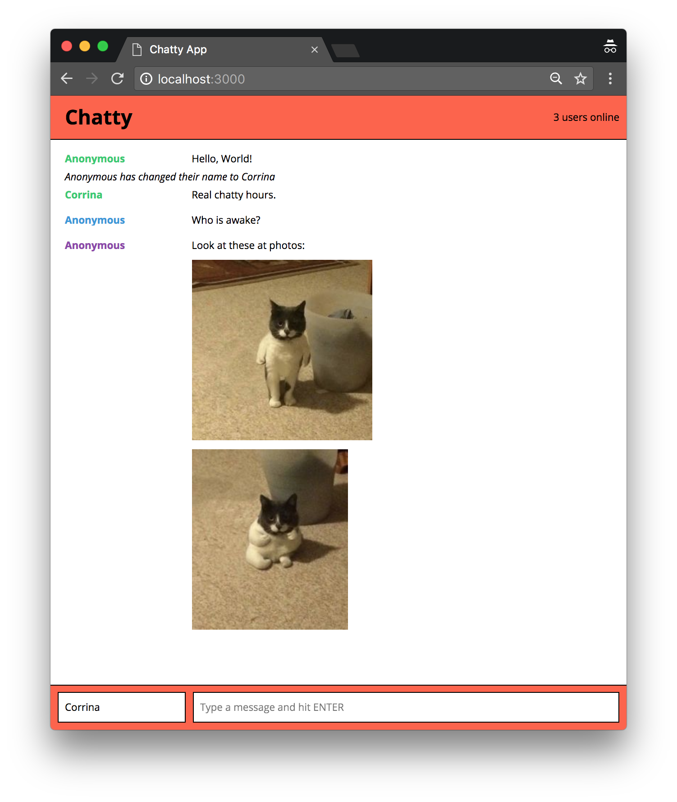

# Chatty App

Chatty App is a single page app built with React.JS that allows connected users to send messages either anonymously or under a chosen pseudonym.  Users can also insert multiple image urls which will render in the chat box.

## Final Product

Several users communicating in real-time.

## Getting Started

- Install all depencies using `npm install` command in the root directory as well as the `chatty-server` directory.
- Run the server from the `chatty-server` directory using the `node server.js` command. The server will be served at <http://localhost:3001/>.
- Run the development web server from the root directory using the `npm start` command. The app will be served at <http://localhost:3000/>.
- Go to <http://localhost:3000/> in your browser.

Install the dependencies and start the server.

## React Dependencies

- babel-core
- babel-loader
- babel-preset-es2015
- babel-preset-react
- babel-preset-stage-0
- css-loader
- eslint
- eslint-plugin-react
- node-sass
- sass-loader
- sockjs-client
- style-loader
- webpack
- webpack-dev-server

## Server Dependencies

- express
- uuid
- ws

### Linting

This project includes React ESLint configuration.

`npm run lint`
